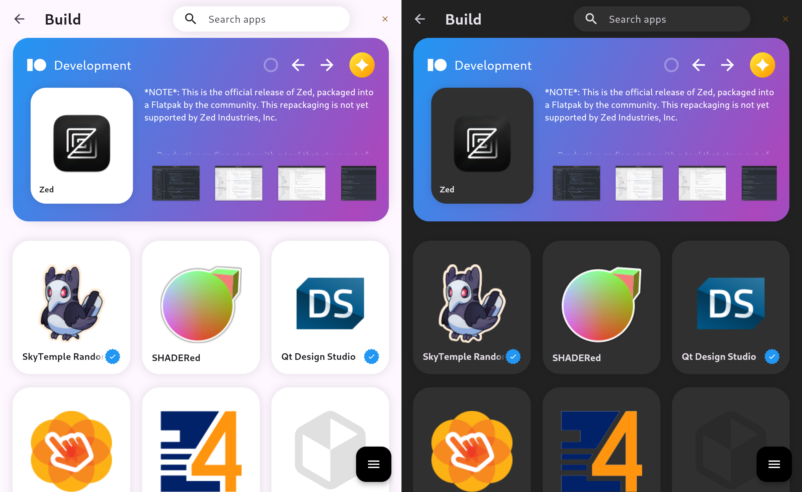
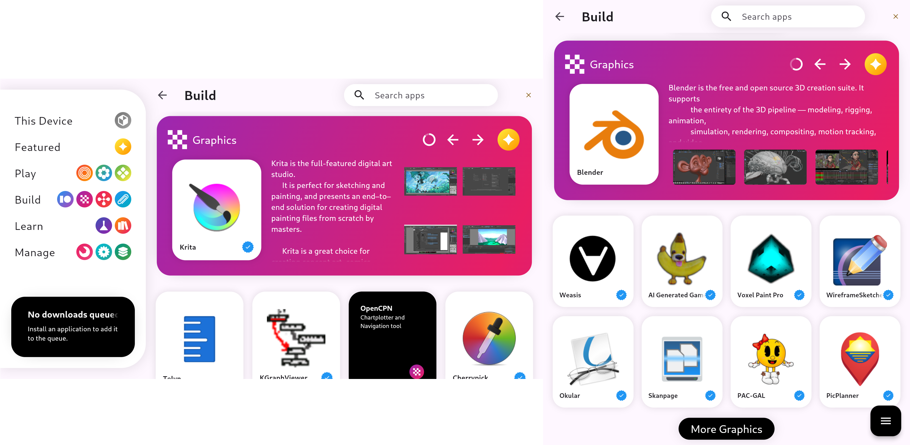
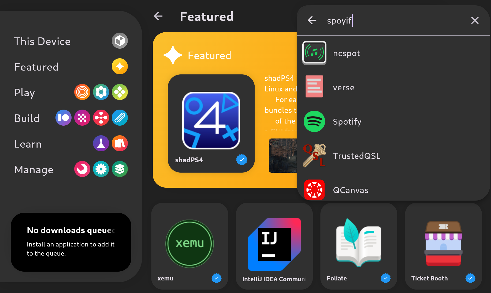

<h1 align="center">
  
  <br>
  Outlet
</h1>


Outlet is a frontend for finding and managing your systems applications.  Built with Flutter, Outlet aims to provide a unique user experience than your typical Linux GUI application.  Outlet can be used on many linux distributions as long as they provide `libflatpak`.  

## Features

There are several features that enable robust user experiences and empower users to discover new applications while taking advantage of powerful UI tools provided by Flutter.

### Theme Support

Outlet will read the system theme automatically and adjust to match.



### Dynamic Layout
The sidebar will collapse under certain widths to allow for a more compact experience.  The sidebar can be expanded by clicking the floating action button in the bottom right corner of the application.



### Fuzzy Search
Searching for applications is easy! Thanks to fuzzy search, typos won't prevent you from finding your favorite apps.



## Build Outlet

### Configure Flatpak

Outlet currently only supports flatpak applications.  To set this up, you will need to [install flatpak](https://docs.flathub.org/docs/for-users/installation) on you distribution and then add a flatpak remote.  The most common remote is [Flathub](https://flathub.org), and they provide setup [instructions](https://flathub.org/en/setup) for a variety of distributions.

### Install Dependencies

#### Debian-based distros
> [!NOTE]
> Package names may change depending on the distro version
```bash
sudo apt-get update -y && sudo apt-get upgrade -y;
sudo apt-get install -y curl git unzip xz-utils zip libglu1-mesa \
      clang cmake git libglycin-2-dev \
      ninja-build pkg-config \
      libgtk-3-dev liblzma-dev \
      libstdc++-15-dev libsysprof-6-dev \
      libcloudproviders-dev libflatpak-dev
```
### Setup Flutter
Install flutter in your environment.  This may vary per distribution.  Generic instructions are described in their [docs](https://docs.flutter.dev/get-started/install/linux/desktop).

### Compile Project
```bash
flutter build linux
```

> [!IMPORTANT]
> `FLATPAK_ENABLED=1` must be set to enable Flatpak support
### Run Executable
```bash
export FLATPAK_ENABLED=1
./build/linux/x64/release/bundle/outlet

# or

FLATPAK_ENABLED=1 ./build/linux/x64/release/bundle/outlet
```


## Flutter Resources

A few resources to get you started if this is your first Flutter project:

- [Lab: Write your first Flutter app](https://docs.flutter.dev/get-started/codelab)
- [Cookbook: Useful Flutter samples](https://docs.flutter.dev/cookbook)

For help getting started with Flutter development, view the
[online documentation](https://docs.flutter.dev/), which offers tutorials,
samples, guidance on mobile development, and a full API reference.
